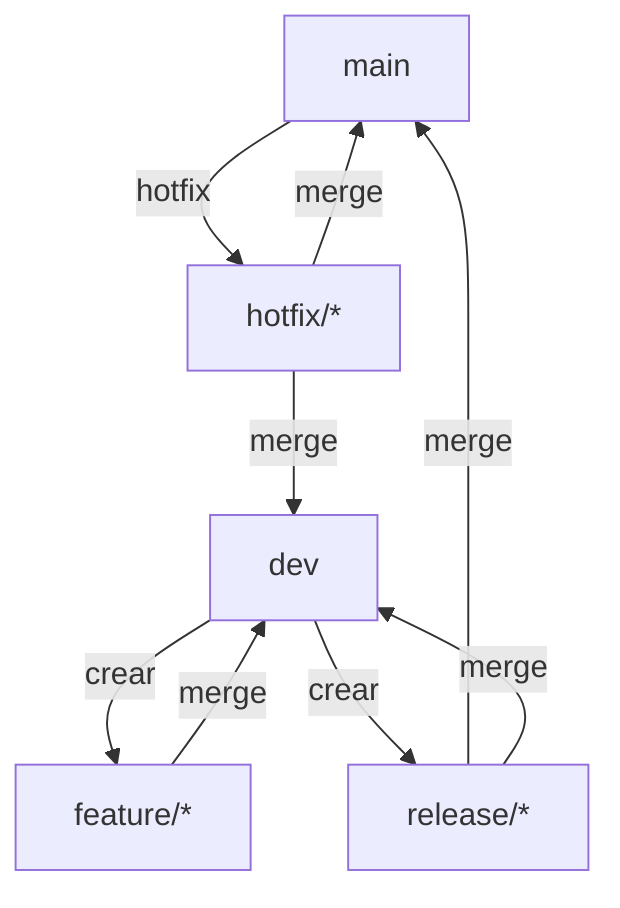

# Gitflow del Proyecto Frontend

Este documento describe el **flujo de trabajo Git (Gitflow)** adoptado para este proyecto de desarrollo **Angular**. El objetivo es estandarizar la forma en que se crean ramas, se desarrollan funcionalidades, se corrigen errores y se publican versiones, garantizando trazabilidad, calidad y colaboración eficiente, alineado con las buenas prácticas del ecosistema Angular.

---

## 1. Ramas principales

### `main`

- Contiene **únicamente código en producción**.
- Cada commit en `main` representa una versión liberada.
- Está protegida: no se permite push directo.
- Siempre debe estar estable y desplegable.

### `dev`

- Rama de **integración** del desarrollo.
- Contiene el código que será incluido en la próxima versión.
- Todas las funcionalidades y correcciones se integran aquí antes de llegar a `main`.

---

## 2. Ramas de soporte

### `feature/*`

- Se utilizan para desarrollar **nuevas funcionalidades**.
- Se crean siempre desde `dev`.
- Se eliminan una vez integradas.

**Convención de nombres:**

```bash
feature/nombre-funcionalidad
```

**Flujo:**

1. Crear la rama desde `dev`.
2. Desarrollar la funcionalidad.
3. Commits pequeños y descriptivos.
4. Abrir Pull Request (PR) hacia `dev`.
5. Revisión y merge.

---

### `bugfix/*`

- Para correcciones de errores detectados durante el desarrollo.
- Se crean desde `dev`.

**Convención de nombres:**

```bash
bugfix/descripcion-del-bug
```

---

### `release/*`

- Preparan una **nueva versión** para producción.
- Permiten estabilizar el código, ajustar versiones y documentación.
- Se crean desde `dev`.

**Convención de nombres:**

```bash
release/x.y.z
```

**Flujo:**

1. Crear la rama `release` desde `dev`.
2. Ajustar versión (`package.json`).
3. Correcciones menores (no nuevas features).
4. Merge a `main`.
5. Crear tag de versión.
6. Merge de vuelta a `dev`.

---

### `hotfix/*`

- Para **errores críticos en producción**.
- Se crean desde `main`.

**Convención de nombres:**

```bash
hotfix/descripcion-critica
```

**Flujo:**

1. Crear la rama desde `main`.
2. Corregir el problema.
3. Incrementar versión (patch).
4. Merge a `main` y crear tag.
5. Merge a `dev` para mantener consistencia.

---

## 3. Versionado

El proyecto utiliza **Semantic Versioning**, alineado con el versionado del `package.json` y del `angular.json`.

```
MAJOR.MINOR.PATCH
```

- **MAJOR**: cambios incompatibles (breaking changes en componentes, módulos o APIs).
- **MINOR**: nuevas funcionalidades compatibles.
- **PATCH**: correcciones de errores.

El versionado se gestiona mediante:

```
MAJOR.MINOR.PATCH
```

- **MAJOR**: cambios incompatibles.
- **MINOR**: nuevas funcionalidades compatibles.
- **PATCH**: correcciones de errores.

El versionado se gestiona mediante:

```bash
npm version patch | minor | major
```

---

## 4. Commits

Se recomienda seguir **Conventional Commits**:

- `feat:` nueva funcionalidad
- `fix:` corrección de errores
- `chore:` tareas de mantenimiento
- `refactor:` refactorización sin cambios funcionales
- `docs:` documentación
- `test:` pruebas

**Ejemplo:**

```bash
feat: agregar validación de formulario
```

---

## 5. Pull Requests

Todo cambio debe realizarse mediante **Pull Request**:

- Revisión obligatoria por al menos un desarrollador.
- Tests y lint deben pasar correctamente.
- No se permiten merges directos a `main` o `dev`.

---

## 6. Resumen del flujo

1. `feature/*` y `bugfix/*` → `dev`
2. `release/*` → `main` + tag → `dev`
3. `hotfix/*` → `main` + tag → `dev`

---

## 7. Consideraciones específicas para Angular

- Las **features** suelen corresponder a:
  - Nuevos módulos (`NgModule` o standalone).
  - Componentes, directivas o pipes.
  - Integraciones con servicios o APIs.

- Antes de abrir un PR:
  - Ejecutar `ng lint`.
  - Ejecutar `ng test`.
  - Verificar `ng build` sin errores.

- Evitar cambios estructurales grandes directamente en `dev`; deben ir bien acotados en `feature/*`.

---

## 8. Diagrama de flujo Gitflow



---

Este flujo permite escalar el desarrollo Angular manteniendo estabilidad, trazabilidad y control de versiones.
